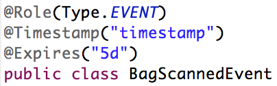

= JBoss BRMS 6.0 Workshop

Event:: A [blue]#significant# [red]#change of state# at a [green]#particular point in time#.

Complex Event Processing:: The ability to [blue]#detect#, [red]#correlate#, [green]#abstract, aggregate or compose# and react to events. 

Event Detection:: From an event cloud or set of streams, select all the meaningful events, and only them.

(Temporal) Event Correlation:: Ability to correlate events and facts declaring both temporal and non-temporal constraints between them. Ability to reason over event aggregation.

Event Abstraction:: Ability to compose complex events from atomic events AND reason over them.

== Complex Event Processing

Complex Event Processing allows one to reason over Events. JBoss BRMS 6 provides extensive support for CEP through the Drools Fusion project.

The key difference between reasoning over _facts_ and reasoning over _events_ is that with _events_, one can reason over time. E.g. one can reason over time-based correlations using, among other things, temportal operators. E.g. did this event happen before that event. Did this event start at the same time as that event, etc.

== KieBase Configuration
=== Event Processing Modes
Drools/BRMS defines 2 processing modes:

* CLOUD
* STREAM

==== Cloud 
Cloud mode is the default Drools/BRMS processing mode.

When running in CLOUD mode, the engine sees all facts in the working memory, regular facts or events, as a whole. There is no notion of flow of time, although events have a timestamp as usual. In other words, although the engine knows that a given event was created, for instance, on January 1st 2009, at 09:35:40.767, it is not possible for the engine to determine how "old" the event is, because there is no concept of "now".

In this mode, the engine will apply its usual many-to-many pattern matching algorithm, using the rules constraints to find the matching tuples, activate and fire rules as usual.

This mode does not impose any kind of additional requirements on facts. So for instance:

* There is no notion of time. No requirements clock synchronization.
* There is no requirement on event ordering. The engine looks at the events as an unordered cloud against which the engine tries to match rules.

==== Stream
The STREAM processing mode is the mode of choice when the application needs to process streams of events. It adds a few common requirements to the regular processing, but enables a whole lot of features that make stream event processing a lot simpler.

The main requirements to use STREAM mode are:

* Events in each stream must be time-ordered. I.e., inside a given stream, events that happened first must be inserted first into the engine.
* The engine will force synchronization between streams through the use of the session clock, so, although the application does not need to enforce time ordering between streams, the use of non-time-synchronized streams may result in some unexpected results.

To enable STREAM-mode, one can configure the _eventProcessingMode_ attribute of the 'KieBase' in the 'kmodule.xml' file:

[source, xml]
----
<?xml version="1.0" encoding="UTF-8"?>
<kmodule xmlns="http://jboss.org/kie/6.0.0/kmodule">
    <kbase name="rules" equalsBehavior="equality" eventProcessingMode="stream" packages="rules">
        <ksession name="ksession-rules" default="true" type="stateful" clockType="pseudo"/>
    </kbase>
</kmodule>
----

Another option is to the STREAM-mode using the 'KieBaseConfiguration' object, like so:

[source, java]
----
KieBaseConfiguration config = KieServices.Factory.get().newKieBaseConfiguration();
config.setOption( EventProcessingOption.STREAM );
----

Or using a Java configuration option:
[source, java]
----
drools.eventProcessingMode = stream
----

== Events
What defines an Event? An Event is basically a Fact with a number of additional characteristics:

Event Declaration and Semantics
 Event semantics:
* An event defines either a point-in-time or an interval
* An event is usually immutable, however, this is not enforced by BRMS.
* An event has a strong temporal relationship
* All Events are Facts,but not all Facts are Events

What technically makes a Fact and Event? In Drools, an Event is defined by marking/declaring a Fact as an Event. This can be done in different ways:

* Using the _declare_ semantics in a _.drl_ file.
* Using the Drools _@Role(Type.EVENT)_ annotation.

A key aspect that distinguishes an Event from a Fact is the notion of time. An Event:

* must have a *timestamp*
* can have a *duration*

Hence, JBoss BRMS can both model point-in-time and interval-based events. A point-in-time event is represented as an interval-based event with duration = 0. 
Both the timestamp and duration can be configured on the Event, either via the _declare_ semantics in a _.drl_ file or via a Drools annotation.

As stated earlier, an Event must have a timestamp. However, one does not need to specifically declare a timestamp field on the Event.

* When a timestamp field is explicitly specified on an Event, the engine uses the value of that field as the Event's timestamp.
* When a timestamp field is not explicitly specified, the engine implicitly sets the time of event insertion as the Event's timestamp.

The images below provide a number of examples on how Events and their properties can be declared:

== Temporal operators
As one of the characterisitics of an _event_ is that it is something that happened at a [green]#particular point in time#, a key concept within CEP are _temporal operators_

As discussed earlier, an event can both be:

* A point in time: the event has a timestamp and a 0 duration.
* An interval: the event has both a timestamp and a non-0 duration.

Therefore, temporal operators can be defined for combinations of:

* 2 point-in-time events
* A point-in-time and an interval event
* 2 interval events

Note that some combinations can only be used with a subset of the available temporal events.

Temporal reasoning is an extensive field of research, from its roots on Temporal Modal Logic to its more practical applications in business systems. There are hundreds of papers and thesis written and approaches are described for several applications. Drools takes a pragmatic and simple approach based on several sources, but specially worth noting the following papers:

* http://citeseerx.ist.psu.edu/viewdoc/download?doi=10.1.1.534.5791&rep=rep1&type=pdf[An Interval-Based Representation of Temporal Knowledge, James F. Allen]
* http://cse.unl.edu/~choueiry/Documents/Allen-CACM1983.pdf[Maintaining knowledge about temporal intervals, James F. Allen]

Drools implements all 13 operators defined by Allen and also their logical complement (negation).

. After: The after evaluator correlates two events and matches when the temporal distance from the current event to the event being correlated belongs to the distance range declared for the operator.
. Before: The before evaluator correlates two events and matches when the temporal distance from the event being correlated to the current correlated belongs to the distance range declared for the operator.
. Coincides: The coincides evaluator correlates two events and matches when both happen at the same time. Optionally, the evaluator accept thresholds for the distance between events' start and finish timestamps.
. During: The during evaluator correlates two events and matches when the current event happens during the occurrence of the event being correlated.
. Finishes: The finishes evaluator correlates two events and matches when the current event's start timestamp happens after the correlated event's start timestamp, but both end timestamps occur at the same time.
. Finished By: The finishedby evaluator correlates two events and matches when the current event start timestamp happens before the correlated event start timestamp, but both end timestamps occur at the same time. This is the symmetrical opposite of finishes evaluator.
. Includes: The includes evaluator correlates two events and matches when the event being correlated happens during the current event. It is the symmetrical opposite of during evaluator.
. Meets: The meets evaluator correlates two events and matches when the current event's end timestamp happens at the same time as the correlated event's start timestamp.
. Met By: The metby evaluator correlates two events and matches when the current event's start timestamp happens at the same time as the correlated event's end timestamp.
. Overlaps: The overlaps evaluator correlates two events and matches when the current event starts before the correlated event starts and finishes after the correlated event starts, but before the correlated event finishes. In other words, both events have an overlapping period.
. Overlapped By: The overlappedby evaluator correlates two events and matches when the correlated event starts before the current event starts and finishes after the current event starts, but before the current event finishes. In other words, both events have an overlapping period.
. Starts: The starts evaluator correlates two events and matches when the current event's end timestamp happens before the correlated event's end timestamp, but both start timestamps occur at the same time.
. Started By: The startedby evaluator correlates two events and matches when the correlating event's end timestamp happens before the current event's end timestamp, but both start timestamps occur at the same time.

These 13 operators, and their relationship to point-in-time <-> point-in-time, point-in-time <-> interval and interval <-> interval event combinations is shown in the pictures below.

 

== Sliding Windows
Apart from temporal operators, BRMS has other time (and length) based correlation concepts. One of these concepts is _sliding windows_. Sliding Windows are a way to scope the events of interest by defining a window that is constantly moving. The two most common types of sliding window implementations are time based windows and length based windows.

=== Time based Sliding Windows
Time-based sliding windows allow one to scope events based on a constantly moving, time-based window:

* Match all BagScannedEvents that happened in the SORTING location in the last 60 minutes.

[source,java]
----
rule "Bags entered Sorting in the last 60 minutes"
when
        $event:BagScannedEvent(location == Location.SORTING) over window:time( 60m )
then
        System.out.println("BagScannedEvent entered SORTING: " + $event);
end
----

This rule will match and fire for *all* events that entered the SORTING stage in the last 60 minutes. I.e. it will fire once for every event.

=== Length based Sliding Windows
Drools/BRMS also knows the concept of length-based sliding windows. These sliding windows allow one to define a sliding window over the last number of matching events:

* Match the last 20 BagScannedEvents that happened in the SORTING location:

[source, java]
----
rule "Last 20 bags that entered the SORTING location"
when
	$event:BagScannedEvent(location == Location.SORTING) over window:length ( 20 )
then
	System.out.println("BagScannedEvent entered SORTING: " + $event);
end
----

=== Sliding Windows and Accumulates
Sliding windows start to be become particularly interesting when combined with accumulate semantics. When using the two concepts together, one can for example define rules that calculate the moving average of a certain field of a set of events. For example, in our BagScannedEvent use-case, we can calculate the average weight of the last 20 bags, or the average time it took for the last 20 bags to go from CHECK_IN to the SORTING location.

A simple example that calculates the average weight of the last 20 bags that entered the SORTING location could look something like this:

[source, java]
----
rule "Average weight of the last 20 bags that entered the SORTING location."
when
	$number:Number() from accumulate($event:BagScannedEvent(location == Location.SORTING) over window:length( 20 ), average($event.getWeight())) 
then
	System.out.println("Average weight of the last 20 bags that entered the SORTING location: " + $number);
end
----

== Clocks
As CEP works heavily with the concept of time, the rules engine needs a reference clock. Comparing timestamps of events with temporal operators is something that could be done without a clock (did this event occur before that event), but for a lot of temporal operations and sliding windows, the engine needs to know what the current time is. E.g. what's the average stock-price over the last 60 minutes, did an event *not* occur within 30 seconds after the current event, etc.

JBoss BRMS/Drools provides 2 clocks, so called http://docs.jboss.org/drools/release/latest/kie-api-javadoc/org/kie/api/time/SessionClock.html[SessionClock] implementations out-of-the-box:

* Real Time Clock: uses the system clock to determine the current timestamp.
* Pseudo Clock: a clock that can be controlled by the application.
 
=== Realtime Clock
The Realtime Clock uses the system clock to determine the current timestamp. Hence, the clock progresses automatically as the system clock progresses.

The engine uses the RealtimeClock by default. However, it can be explicitly configured in the _kmodule.xml_:

[source, xml]
----
<?xml version="1.0" encoding="UTF-8"?>
<kmodule xmlns="http://jboss.org/kie/6.0.0/kmodule">
    <kbase name="rules" equalsBehavior="equality" eventProcessingMode="stream" packages="rules">
        <ksession name="ksession-rules" default="true" type="stateful" clockType="realtime"/>
    </kbase>
</kmodule>
----

When an event does not explicitly define a timestamp, the engine uses the time of the clock to assign the event a timestamp. In the case of the Realtime Clock, this will be the system time when the event is inserted into WorkingMemory (the KieSession).

=== Pseudo Clock
The second clock-type that Drools/BRMS provides out-of-the-box is the Pseudo Clock. The Pseudo Clock is a clock implementation that allows on to control clock progression from the application code (or from rules).

One area in which this clock is often used is in unit-testing. I.e. it's quite unfeasible to test rules that, for example, correlate events with temporal constraints covering minutes, hours, days or even weeks. In these cases, being able to advance the clock from application code by minutes, hours, days and weeks allows one to easily test these rules from within a unit-test.

To use the Pseudo Clock implementation, one has to explicitly configure the session to use it. This can for example be done in the Drools _kmodule.xml_, like this:

[source,xml]
----
<?xml version="1.0" encoding="UTF-8"?>
<kmodule xmlns="http://jboss.org/kie/6.0.0/kmodule">
    <kbase name="rules" equalsBehavior="equality" eventProcessingMode="stream" packages="rules">
        <ksession name="ksession-rules" default="true" type="stateful" clockType="pseudo"/>
    </kbase>
</kmodule>
----

To use it, one can retrieve the clock from the 'KieSession', and advance it using the following code:

[source,java]
----
PseudoClockScheduler clock = kieSession.getSessionClock();
long deltaTime = 60000;
//Advance the clock with 60 seconds
clock.advanceTime(deltaTime, TimeUnit.MILLISECONDS);
----

Apart from using the Pseudo Clock for testing, there are more scenarios in which this clock-type can be preferred over other clocks. One of the key characteristics of this clock is that it allows for determinic execution of the engine. One scenario in which it can be used is in, so called 'replay scenarios', where one wants to replay the behaviour of the engine by resetting the KieSession to a particular point-in-time and replaying the events. In this case, using the Realtime Clock would most likely give one different results than the results one got in the original event processing due to the fact that the clock-time will not be the same in the replay scenario. Second, when replaying events, one would not want to have to insert the events with the same time-distance as they originally were inserted into the engine. This could span minutes, hours, days or even weeks.

In such cases, it can be beneficial to explicitly define the timestamp on the event itself (rather than having the engine assign one on event insertion). Second, the Pseudo-Clock can be used in such a way that the application determines the delta between the timestamp of the inserted event and the current clocktime. The application can then advance the clock with this delta, allowing for a deterministic progression of the clock.

One example use-case in which this approach has been used is in High Available Complex Event Processing.

The sample code below shows a possible implementation. This code inserts an event into the session, determines the delta between the event-time and the current clock-time and advances the clock with the calculated delta.

[source, java]
----
private static void insertAdvanceAndFire(KieSession kieSession, Event event) {
	PseudoClockScheduler clock = kieSession.getSessionClock();
	kieSession.insert(event);
	long deltaTime = event.getTimestamp().getTime() - clock.getCurrentTime();
	if (deltaTime > 0) {
		LOGGER.info("Advancing clock with: " + deltaTime);
		clock.advanceTime(deltaTime, TimeUnit.MILLISECONDS);
	}
	kieSession.fireAllRules();
}
----

== Event Memory Management: Expiration
In most CEP use-cases, the Drools/BRMS engine runs as a _Stateful_ session, and continuously receives a stream of events that is inserted into the engine. One can easily see that, if no clean-up is done, the engine can run out-of-memory, and crash, basically destroying the state of the session. The solution that Drools/BRMS provides to this problem is event expiration.

When the engine runs in STREAM mode, it can detect when events can no longer match rules, and based on this information, automatically remove the event from WorkingMemory. The engine has basically 2 ways to calculate the matching window for a given event.

* explicitly, using the expiration policy
* implicitly, analyzing the temporal constraints on events.

=== Explicitly setting event expiration
Explicitly setting the event expiration can be done in the _declare_ section of an event in a _.drl_ file, using the _@expires_ keyword:

[source, java]
----
declare BagScannedEvent
   @role(event)
   @timestamp(timestamp)
   @expires(5d)
end
----

=== Inferred expiration offset
Another way for the engine to calculate the expiration offset for a given event is implicitly, by analyzing the temporal constraints in the rules. For instance, given the following rule:

[source, java]
----
rule "correlate orders"
when
    $bo : BuyOrderEvent( $id : id ) 
    $ae : AckEvent( id == $id, this after[0,10s] $bo )
then
    // do something
end
----

Analyzing the above rule, the engine automatically calculates that whenever a BuyOrderEvent matches, it needs to store it for up to 10 seconds to wait for matching AckEvent's. So, the implicit expiration offset for BuyOrderEvent will be 10 seconds. AckEvent, on the other hand, can only match existing BuyOrderEvent's, and so its expiration offset will be zero seconds.

=== Expiration implementation
Expiration of events is implemented using sheduled ExpireActions. When events in STREAM mode are used in JBoss BRMS, the system schedules one or more WorkingMemoryReteExpireActions per event (it creates multiple actions when the events is a subclass of another event, where both event declarations have an expiration). The expiration-offset is defined per ObjectTypeNode (OTN), the RETE node that matches a certain object-type. The expiration-time is determined by analysing the timestamp of the event, the duration of the event (if used), the expiration-offset of the OTN that matches the event-type, and the current clock-time. Depending on the current clock-time, the ExpireAction is either scheduled on the TimerService, or the action is directly added to the BRMS PropagationQueue to be executed on the next flush of that queue.

When the ExpireAction is executed, the event is only removed from the OTN for which the expiration was scheduled. This means that if an event is a subclass of another event, and 2 expirations have been scheduled for the given event, the event will not be completely removed from WorkingMemory. In that case the event will only be removed from the OTN that matches the expiration schedule.

== Drools Fusion Labs
These Drools Fusion labs aim to build-up a small rulebase for an airport baggage scanning system, using Complex Event Processing ordering system. The lab starts with a small, pre-defined fact and event-model and a simple rule-base. The idea is to gradually expand the rule-base and add new features using more sophisticated Drools CEP concepts, effectively building new and more sophisticated functionality.

=== Fact/Event Model
The _fact model_ contains the classes that define the facts and events over which the rules will reason. We will create objects from these classes and inject them into the Drools WorkingMemory (session).

The examples are modelled around an airport baggage scanning system. The rules are, among other things, responsible for detecting lost luggage, calculating the amount of luggage that enters a certain location at the airport and calculating the average processing time to detect potential upcoming problems early in the system.

The model contains the following classes:

. `BagScannedEvent`: The event implementation when a bag gets scanned.
. `Location`: Enumeration that defines the location at which the bag got scanned. This can be _CHECK_IN_, _SORTING_, _STAGING_ or _LOADING_.
. `BagTag`: The tag attached to the bag.

The BagScannedEvent has a reference to the BagTag. Also, the `BagScannedEvent` has a reference to the `Location`. This allows us to use the same event-type for different scans throughout the system.

=== Implementation
All labs have a `Main` class that is responsible for boot-strapping the Drools/BRMS engine, reading the events from a CSV-file, inserting the events into the session, advancing the clock and firing the rules. As we want to mostly focus on writing rules, most of the surrounding logic (creating a `KieBase`, spinning of `KieSessions`, inserting events, firing rules) has already been pre-defined.

=== Lab 1

